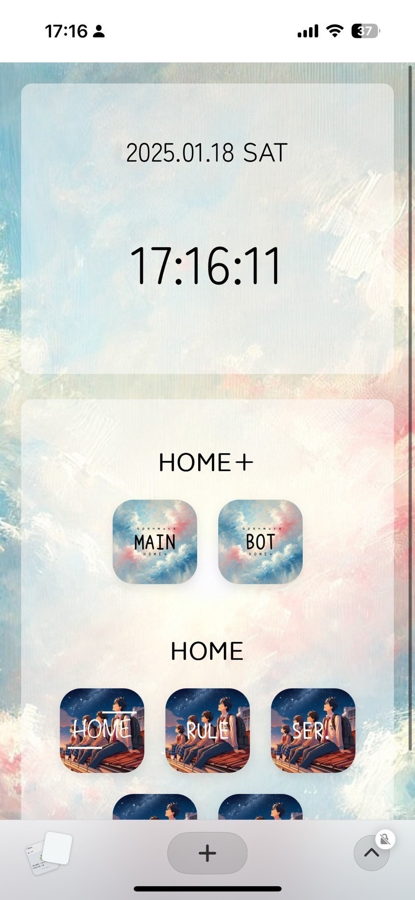
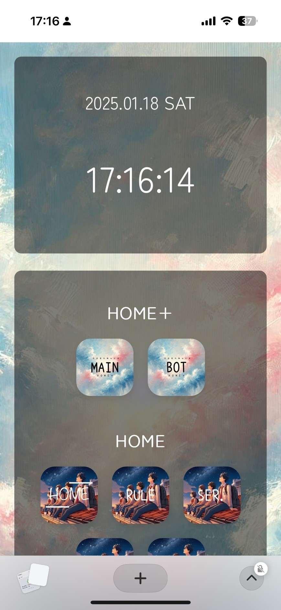

# レポジトリについて
これは、HTML,CSS,JavaScriptで構成されています。


## インストール方法
1. リポジトリをクローン
   ```bash
   git clone https://github.com/openmura/home.git```
2. 依存関係をインストール
   ```bash
    npm install
3. プロジェクトを実行
   ```bash
    npm start
## 使用方法
- ホームページでルールの確認などを行えます。
- 他のページへもアクセスすることができます。
## 技術スタック
HTML5
CSS3
JavaScript
## ライセンス
本プロジェクトはMITライセンスで公開されています。
## 貢献方法
1. リポジトリをフォーク
2. フィーチャーブランチを作成
3. プルリクエストを送信
4. 直接管理者にも連絡下さい。
## クレジット
本プロジェクトはkadoによって作成されました。
